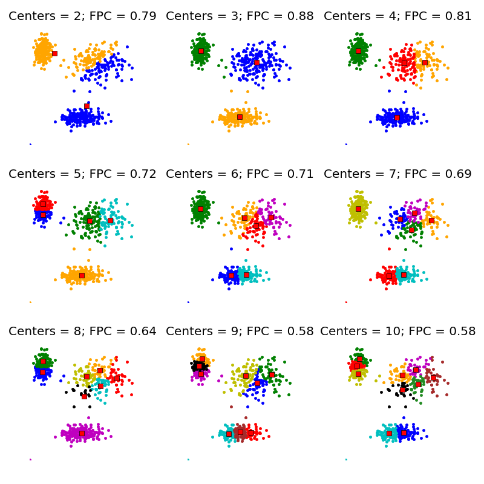

# Analisis Distribusi Normal

Ini adalah rumus fungsi kepadatan probabilitas:

$$f(x) = \frac{1}{\sigma\sqrt{2\pi}} e^{-\frac{1}{2}\left(\frac{x-\mu}{\sigma}\right)^2}$$

## Nilai Ekspektasi (Mean)
Nilai harapan atau rata-rata dari distribusi normal disimbolkan sebagai:

$$E(X) = \mu$$

